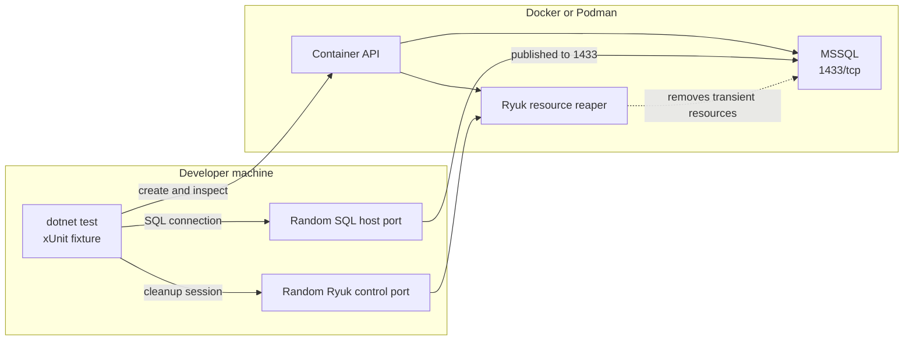
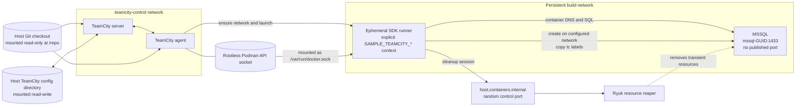

# Architecture

This document is the canonical description of the workspace topology, TeamCity container discovery, Testcontainers networking and cleanup, Podman security boundaries, and production scaling.

## Topologies

### Local development

When `TEAMCITY_VERSION` is absent or blank, the test process runs directly on the developer machine. Testcontainers publishes SQL Server port `1433` to a random host port, and the fixture constructs its connection string from that mapping. Local mode ignores the `SAMPLE_TEAMCITY_*` context variables.

Each fixture creates a uniquely named `mssql-<GUID>` container. Fixture disposal and Ryuk remove the transient resources.

### TeamCity

TeamCity runs the tests inside an ephemeral SDK container. The SDK runner and its SQL Server Testcontainer share a persistent build network and communicate through container DNS; SQL Server does not publish a host port.

The `teamcity-control` network is the control boundary for the server and agent. `teamcity-compose/server-config` is mounted read-write as the complete TeamCity data-directory `config` path; the root VCS definition and `Sample` versioned-settings project definition are committed, while installation-specific runtime and secret files are ignored. Mounting the complete directory ensures TeamCity owns a writable configuration root on first startup instead of relying on Podman to create nested bind-mount parents. The host Git checkout is mounted read-only at `/repo` in both long-running containers and is not a network service. Test runners do not join the control network. Each agent/build-configuration pair instead uses a persistent `tc-<agent name>-<build-type id>` build network. That network remains between builds; the SDK runner, SQL Server, and other per-build Testcontainers are transient.

## Runner discovery and label propagation

`TEAMCITY_VERSION` is the mode switch. TeamCity supplies it automatically inside the SDK runner. When it is set, the fixture requires all explicit `SAMPLE_TEAMCITY_*` context variables and never falls back to a host-published SQL port.

The TeamCity build first idempotently creates its persistent network with these labels:

| Label | Value |
| --- | --- |
| `tc.owner` | TeamCity build-type ID |
| `tc.agent.name` | TeamCity agent name |

TeamCity then starts the SDK runner on that network with `tc.owner`, `tc.agent.name`, and `tc.build.id`. The runner receives the same values plus the network name through `SAMPLE_TEAMCITY_NETWORK`, `SAMPLE_TEAMCITY_OWNER`, `SAMPLE_TEAMCITY_AGENT_NAME`, and `SAMPLE_TEAMCITY_BUILD_ID`. The fixture uses this explicit context to attach SQL Server to the build network and copy all three ownership labels. Any missing or blank context variable fails fixture initialization before SQL Server starts.

Unique GUID-based SQL Server names prevent collisions between concurrent test hosts. The labels retain build ownership and correlation without making container identity depend on mutable TeamCity metadata.

## SQL connectivity and cleanup

In local mode, Testcontainers requests a random host binding for SQL Server `1433` and the tests connect through the returned host and mapped port. In TeamCity mode, SQL Server joins the discovered persistent build network without a published SQL port; the SDK runner connects to `mssql-<GUID>:1433` using container DNS.

Testcontainers' Ryuk resource reaper owns cleanup of transient test resources, including cleanup after an unexpectedly terminated test process. Ryuk exposes one random host port because the client inside the SDK runner maintains its cleanup session through Ryuk's mapped TCP control endpoint. `TESTCONTAINERS_HOST_OVERRIDE=host.containers.internal` directs that connection back to the Podman host. Fixture disposal also disposes SQL Server during a normal run. Neither mechanism removes the persistent build network; administrators should remove obsolete networks after an agent, build configuration, or network parameter is renamed or retired.

## Podman socket and path boundaries

The TeamCity agent and SDK runner receive the rootless Podman API socket at `/var/run/docker.sock`. `DOCKER_HOST=unix:///var/run/docker.sock` selects it; `TESTCONTAINERS_DOCKER_SOCKET_OVERRIDE` is unnecessary because that path is the .NET Testcontainers default.

Socket access grants control over every container, image, volume, and network owned by that rootless Podman user. It can also affect files accessible to the Podman-machine user, including Windows paths shared into containers. Rootless operation limits the boundary, but the socket remains a high-privilege capability within that user's domain. Builds sharing it must be trusted together.

TeamCity's container wrapper sends host bind paths to the Podman API from inside the agent. Therefore every host-backed agent path must have the same absolute Linux path on the Podman host or machine and inside the agent container. For example, `/opt/buildagent/work` must be mounted as `/opt/buildagent/work`, not under a different container path. Correct ownership must also account for rootless user-namespace mapping; `podman unshare chown` maps container UID 1000 to the corresponding subordinate host UID.

## Production scaling: three agents per machine

The checked-in Compose file deliberately implements one agent. A production machine with adequate resources can run three trusted TeamCity agents and execute up to three builds concurrently. TeamCity supports multiple agents when their directories and resources do not conflict, although one agent per VM offers the strongest predictability and isolation. See [Install Multiple Agents on One Machine](https://www.jetbrains.com/help/teamcity/install-multiple-agents-on-one-machine.html).

### Per-agent isolation

Use unique values for every agent-owned resource:

| Resource | Agent 1 | Agent 2 | Agent 3 |
| --- | --- | --- | --- |
| Container name | `teamcity-agent-01` | `teamcity-agent-02` | `teamcity-agent-03` |
| TeamCity agent name | `agent-01` | `agent-02` | `agent-03` |
| Configuration volume | `agent-01-config` | `agent-02-config` | `agent-03-config` |
| Agent directory root | `/opt/buildagents/agent-01` | `/opt/buildagents/agent-02` | `/opt/buildagents/agent-03` |
| Build-network prefix | `tc-agent-01-` | `tc-agent-02-` | `tc-agent-03-` |

Each directory root needs separate `work`, `temp`, `logs`, `tools`, `plugins`, and `system` subdirectories, mounted at identical absolute paths inside its agent. Each agent also needs its own writable configuration volume and authorization token. Do not clone an existing agent configuration volume; start each configuration independently and authorize it in TeamCity.

All three agents may share one rootless Podman service and image cache. That reduces infrastructure and image-storage overhead, but directory separation only prevents accidental file collisions. It is not a security boundary: any socket-enabled agent can inspect, stop, or remove the other agents' resources. The Podman service or machine, storage, network, and host are also shared failure domains.

### Native Linux

Run the rootless Podman service under a dedicated account on the Linux machine. Provision `/opt/buildagents/agent-01`, `agent-02`, and `agent-03` directly on that host, then apply `podman unshare chown -R 1000:1000` as the account that owns the service. If builds need separate trust boundaries or maintenance windows, deploy one agent per Linux VM instead.

### Windows with Podman Machine

Run the three trusted agents inside one adequately sized Podman machine. Provision the `/opt/buildagents/agent-*` trees through `podman machine ssh` before starting the agents. Podman supports only one active Podman-managed VM at a time, so concurrent capacity should come from agents within that machine rather than multiple simultaneously active Podman machines. See [`podman machine start`](https://docs.podman.io/en/stable/markdown/podman-machine-start.1.html).

Stopping and starting the machine preserves its paths; deleting and recreating it requires reprovisioning. For stronger isolation, place each Podman machine and agent on a separate Windows VM or physical host.

### Capacity and operations

- Size CPU, memory, and storage for three simultaneous SDK runners and SQL Server containers in addition to the agents and control services.
- Set resource limits where one build could otherwise starve the other two.
- Monitor memory, disk space, inode use, and image growth on the shared Linux host or Podman machine.
- Keep agent names stable because they participate in persistent network names and labels.
- Remove obsolete persistent build networks after agents or build configurations are renamed or retired.
- Roll out agent-image and TeamCity upgrades one agent at a time and verify a complete build before updating the rest.
- Treat Podman service or Podman-machine maintenance as an outage for every agent sharing it.
