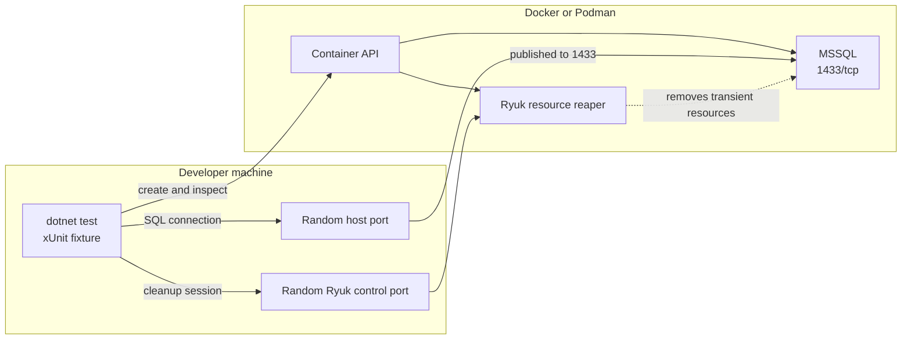
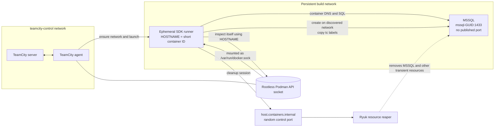

# TeamCity MSSQL Testcontainers sample

This .NET 10 integration-test project demonstrates an isolated TeamCity build:

- TeamCity checks out this Git repository.
- The .NET test step runs in an ephemeral SDK container.
- Each agent/build-configuration pair has one persistent network shared by its SDK runner and SQL Server Testcontainer.
- A shared xUnit fixture gives each SQL Server container a GUID-based name and owns its lifecycle and connection string.
- Local `dotnet test` publishes a random SQL port automatically; in TeamCity, SQL Server is reachable only through container DNS on the build network.

## Architecture

The fixture selects its topology from `TEAMCITY_VERSION`. If that variable is absent or blank, it uses local mode. If it is present, TeamCity discovery must succeed; the fixture never falls back to publishing SQL Server on the host.

### Local development

The test process runs directly on the developer machine. Testcontainers publishes SQL Server's container port `1433` to a random host port and builds the test connection string from that mapping. Local mode does not read `HOSTNAME`.



Local lifecycle:

1. The fixture creates `mssql-<GUID>` and requests a random published port.
2. The test connects through the mapped host port.
3. Fixture disposal and Ryuk remove the transient SQL Server resources.

### TeamCity

TeamCity runs the tests inside an ephemeral SDK container. The runner and MSSQL share a persistent build network, so the test connects to `mssql-<GUID>:1433` through container DNS. SQL Server does not publish a host port.



TeamCity discovery and lifecycle:

1. The agent idempotently creates the persistent `tc-<agent name>-<build-type id>` network with `tc.owner` and `tc.agent.name` labels.
2. TeamCity starts the SDK runner on that network with `tc.owner`, `tc.agent.name`, and `tc.build.id` labels, plus the mounted Podman API socket.
3. Because `TEAMCITY_VERSION` is set, the fixture reads `HOSTNAME` as the runner's short container ID and inspects it through the Podman API.
4. The fixture requires all three runner labels and exactly one attached network whose owner and agent labels match, then creates MSSQL on that network with copies of the runner labels.
5. The test connects to MSSQL by container name. Fixture disposal and Ryuk remove MSSQL and other transient resources, while the persistent build network remains for later builds.

The TeamCity project configuration lives in `.teamcity/settings.kts`. In the demo Compose network, its settings VCS root must use:

```text
git://git-repo:9418/sample-project.git
```

The build agent requires access to its rootless Podman API socket. Container identity is deliberately independent of TeamCity metadata: every fixture creates `mssql-<GUID>`, so concurrent test hosts and builds cannot collide. The fixture uses TeamCity's conventional `TEAMCITY_VERSION` variable only to select CI behavior, then relies on the Docker/Podman convention that `HOSTNAME` contains the SDK runner's short container ID. It inspects that runner to discover the network and copy its `tc.owner`, `tc.agent.name`, and `tc.build.id` labels. TeamCity must not override the SDK runner hostname with `--hostname`. Testcontainers' Ryuk resource reaper removes transient containers, including after the test process terminates unexpectedly.

## SDK runner Docker parameters

The TeamCity .NET step passes the following `docker run` parameters. `TEAMCITY_VERSION` is supplied automatically by TeamCity rather than configured here.

| Parameter | Classification | Consumer | Purpose |
| --- | --- | --- | --- |
| `--network %build.network.name%` | Required | SDK runner / Podman | Joins the runner to the persistent build network so it can resolve the MSSQL container by name. |
| `--label tc.owner=%system.teamcity.buildType.id%` | Required | Fixture and operators | Selects the matching persistent network and identifies the build configuration. |
| `--label tc.agent.name=%teamcity.agent.name%` | Required | Fixture and operators | Selects the matching persistent network and identifies the agent. |
| `--label tc.build.id=%teamcity.build.id%` | Required | Fixture and operators | Supplies the build correlation label copied to MSSQL. |
| `-v /run/user/1000/podman/podman.sock:/var/run/docker.sock` | Required | Testcontainers client | Makes the agent user's rootless Podman API socket available inside the runner. |
| `-e DOCKER_HOST=unix:///var/run/docker.sock` | Required | Testcontainers client | Selects the mounted Podman-compatible API socket. |
| `-e TESTCONTAINERS_HOST_OVERRIDE=host.containers.internal` | Required | Testcontainers client / Ryuk | Supplies the host address used to reach mapped container ports from the runner. |

`TESTCONTAINERS_DOCKER_SOCKET_OVERRIDE` is intentionally not set because `/var/run/docker.sock` is the .NET Testcontainers default. There are no project-specific test environment variables: `DOCKER_HOST` and `TESTCONTAINERS_HOST_OVERRIDE` configure the Testcontainers transport, while TeamCity metadata stays on Docker labels.

Outside TeamCity, run `dotnet test` normally. The fixture assigns a random host port for MSSQL and derives the connection string from Testcontainers; `HOSTNAME` is not used in this mode. When `TEAMCITY_VERSION` is present, `HOSTNAME` must contain the inspectable short ID of a labeled SDK runner with exactly one attached network whose `tc.owner` and `tc.agent.name` labels match. Missing, blank, or uninspectable runner IDs and other discovery errors fail the fixture without starting MSSQL or falling back to a published SQL port.

The SDK image is not force-pulled before every build. Podman uses the agent's cached `mcr.microsoft.com/dotnet/sdk:10.0` image and pulls it when it is initially absent; update or pin that image separately when adopting a deliberate SDK upgrade policy.

The Compose stack uses `teamcity-control` only for server-to-agent traffic. Test runners do not join that network. The `build.network.name` parameter defaults to `tc-<agent name>-<build-type id>`; the build idempotently creates that network and leaves it in place for later builds. Renamed agents, build configurations, or parameter values can leave obsolete networks that an administrator may remove manually.
